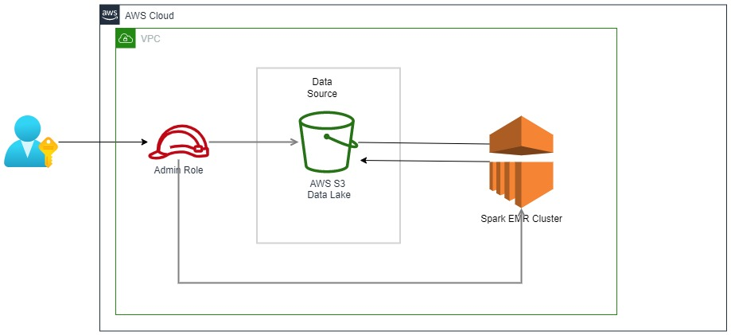
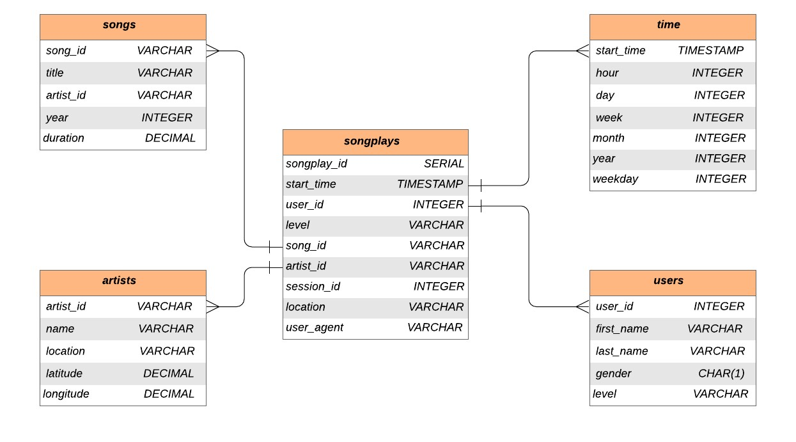

<!-- PROJECT LOGO -->
<br />

<p align="center">
 <a href="https://github.com/Abanoub-20180003/Saprk-with-DataLake-on-AWS">
  
 </a>
 <h3 align="center">Spark With Data Lake on AWS</h3>
 <p align="center">
  Udacity Nanodegree Course Project 3
  <br />
  <a href=hhttps://github.com/Abanoub-20180003/Saprk-with-DataLake-on-AWS><strong>Explore the repository»</strong></a>
  <br />
  <br />
 </p>
</p>

> EMR Cluster,spark, aws, data lake, data engineering, ETL, schema on read


<!-- ABOUT THE PROJECT -->

## About The Project
A startup called Sparkify wants to analyze the data they've collected on songs and user activity on their new music streaming application. We will store data in a data lake on the cloud then build an ETL pipeline that extracts their data from S3, processes them using Spark, and loads the data back into S3 as a set of dimensional tables. This will allow their analytics team to continue finding insights into what songs their users are listening to. Their data resides in S3, in a directory of JSON logs on user activity on the application, and a directory with JSON metadata on the songs in their application. The project is to read data from s3 then process them using spark and load them in dimensional modeling to the s3 data lake.    


### Project Description

In this project, we will build a data lake on AWS and build an ETL pipeline for a database hosted on s3.  The data is loaded from S3 buckets and processed wiht spark into dimensional modeling than saved to s3 data lake.

### Built With

* python
* AWS

### Dataset

#### Song Dataset

Songs dataset is a subset of [Million Song Dataset](http://millionsongdataset.com/). Each file in the dataset is in JSON format and contains meta-data about a song and the artist of that song. The dataset is hosted at S3 bucket `s3://udacity-dend/song_data`.

Sample Record :

```
{"num_songs": 1, "artist_id": "ARJIE2Y1187B994AB7", "artist_latitude": null, "artist_longitude": null, "artist_location": "", "artist_name": "Line Renaud", "song_id": "SOUPIRU12A6D4FA1E1", "title": "Der Kleine Dompfaff", "duration": 152.92036, "year": 0}
```

#### Log Dataset

Logs dataset is generated by [Event Simulator](https://github.com/Interana/eventsim). These log files in JSON format simulate activity logs from a music streaming application based on specified configurations. The dataset is hosted at S3 bucket `s3://udacity-dend/log_data`.

Sample Record :

```
{"artist": null, "auth": "Logged In", "firstName": "Walter", "gender": "M", "itemInSession": 0, "lastName": "Frye", "length": null, "level": "free", "location": "San Francisco-Oakland-Hayward, CA", "method": "GET","page": "Home", "registration": 1540919166796.0, "sessionId": 38, "song": null, "status": 200, "ts": 1541105830796, "userAgent": "\"Mozilla\/5.0 (Macintosh; Intel Mac OS X 10_9_4) AppleWebKit\/537.36 (KHTML, like Gecko) Chrome\/36.0.1985.143 Safari\/537.36\"", "userId": "39"}
```


## Database Schema Design

### Data Model ERD

The Star Database Schema (Fact and Dimension Schema) is used for data modeling in this ETL pipeline. There is one fact table containing all the metrics (facts) associated to each event (user actions), and four dimensions tables, containing associated information such as user name, artist name, song meta-data etc. This model enables to search the database schema with the minimum number of *SQL JOIN*s possible and enable fast read queries.

The data stored on S3 buckets is extracted to spark data frames. Then the data processed using spark, transformed and inserted into the fact and dimensional files that stored in aws s3 data lake. An entity relationship diagram (ERD) of the data model is given below. 



## Project structure

Files in this repository:

|     File / Folder      |                         Description                          |
| :--------------------: | :----------------------------------------------------------: |
|         images         |  Folder at the root of the project, where images are stored  |
|         data           | Contains the song and log data files                         |
|         etl.py         | Stages and transforms the data from S3 buckets and loads them into tables |
|         etl.ipynb      | same as etl.py bust for testing each step in thr project     |
|        dl.cfg          |              Sample configuration file for AWS               |
|         README         |                         Readme file                          |


<!-- GETTING STARTED -->

## Getting Started

Clone the repository into a local machine using

```sh
git clone https://github.com/Abanoub-20180003/Saprk-with-DataLake-on-AWS.git
```

### Prerequisites

These are the prerequisites to run the program.

* python 3.7
* AWS account
* psycopg2 python library
* boto3 python library
* pyspark library 

### How to run

Follow the steps to extract and load the data into the data model.

1. Navigate to `Spark With Data Lake on AWS ` folder

2. Edit the `dl.cfg` configuration script and fill in the AWS Access Key and Secret Key fields, Then save this file. 

3. Run `etl.py` to create the clusters on AWS by

   ```python
   python etl.py
   ```


